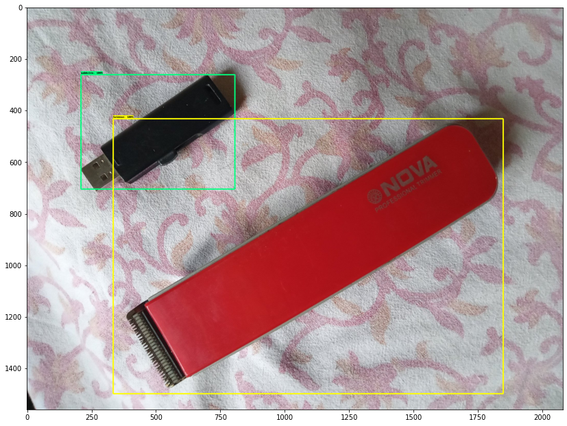

# tensorflow-custom-object-detection
This repository contains details regarding object detection using tensorflow API.

>```diff
>+ objectDetectionWithSSD.ipynb
>```
>file contains code that can be executed on local or colab. This notebook works with SSD model, any other model can be used, just replace the links regarding SSD. >Also, if other type of model is used, _pipeline.comfig_ needs to be changed according to the model's specification.

<b>Example:</b>
<p align="center">
  
</p>
